# Plugin.Maui.Chat

`Plugin.Maui.Chat` provides highly customizable chat control providing text and voice messaging. 

> [!NOTE]
> Because of many issues with Windows UI and behavior of particular components, it has to be considered that difficulties had gone far beyond author patience and won't be scheduled to fix for some time.

## Install Plugin

[](https://www.nuget.org/packages/Plugin.Maui.Chat/)

Available on [NuGet](http://www.nuget.org/packages/Plugin.Maui.Chat).

Install with the dotnet CLI: `dotnet add package Plugin.Maui.Chat`, or through the NuGet Package Manager in Visual Studio.

### Supported Platforms

| Platform | Minimum Version Supported |
|----------|---------------------------|
| iOS      | 11+                       |
| macOS    | 10.15+                    |
| Android  | 5.0 (API 21)              |
| Windows  | 11 and 10 version 1809+   |

## API Usage

`Chat` control may be roughly divided in two fields:
- Collection of messages of `ChatMessages` type.
- User message entry field with buttons attached.

`ChatMessage` properties:
- `DateTime` which is getter only and provides the date and time at which `ChatMessage` was created. The visibility of message timestamp can be set by related property (see: [Sent and received messages](https://github.com/ArturWyszomirski/Plugin.Maui.Chat?tab=readme-ov-file#sent-and-received-messages));
- `Type` of `MessageType` which can be `Sent` (written by user), `Received` (sent to the user) or `System` (informational type).
- `Author` of string type is the author of the message. The visibility of message author can be set by related property (see: [Sent and received messages](https://github.com/ArturWyszomirski/Plugin.Maui.Chat?tab=readme-ov-file#sent-and-received-messages));
- `TextContent` is message's text content
- `AudioContent` is message's audio content

The send button is by default disabled if the field is empty or consist only whitespace characters.

Visibility of other buttons in the user message entry field as well as their's icons, colors and behaviors can be easily switched on or off (see: [Customized usage](https://github.com/ArturWyszomirski/Plugin.Maui.Chat?tab=readme-ov-file#customized-usage)).

> [!NOTE]
> Below examples assumes using MVVM architecture with ViewModel binded to the XAML page.

### Dependency Injection

This NuGet depends on `MAUI Community Toolkit`, so you will first need to register the `Feature` with the `MAUI Community Toolkit`.

```csharp
builder.UseMauiCommunityToolkit();
```

### XAML

To use `Chat` you need to register `Plugin.Maui.Chat.Controls` namespace by adding below line to XAML file opening tag.

> [!WARNING]
> Make sure you are adding `Plugin.Maui.Chat.Controls` namespace, not the `Plugin.Maui.Chat`.

```xaml
<ContentPage ...
             xmlns:chat="clr-namespace:Plugin.Maui.Chat.Controls;assembly=Plugin.Maui.Chat"
             ...>
```

### Simple usage

> [!NOTE]
> By default colors corresponds to those set in `Resources\Styles\Colors.xaml`, but can be easily changed (see: [Customized usage](https://github.com/ArturWyszomirski/Plugin.Maui.Chat?tab=readme-ov-file#customized-usage)).

#### Text messaging

<a href="./assets/screenshots/simple_chat_01.png">
  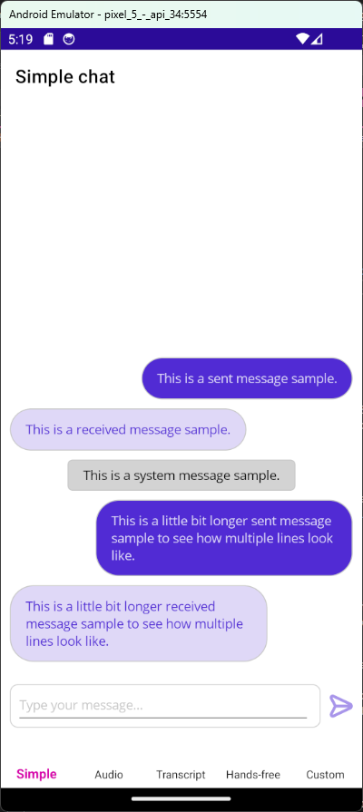
</a>
<a href="./assets/screenshots/simple_chat_02.png">
  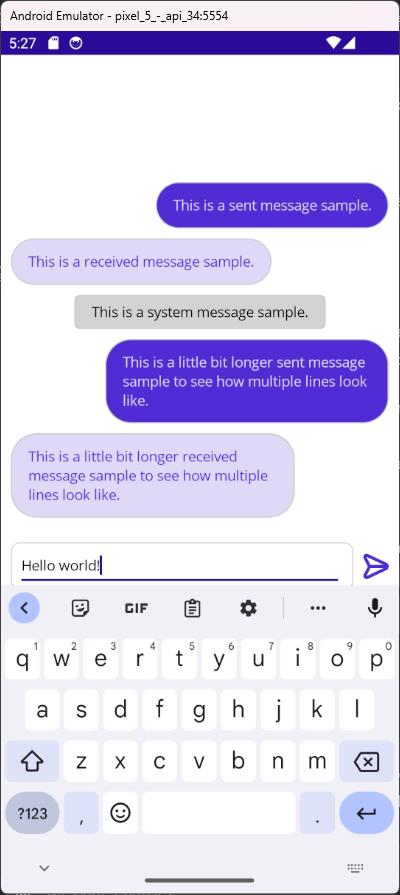
</a>

All you have to do to get started is to deal with those three properties:
- `ChatMessages` which is a collection of `ChatMessage`,
- `TextContent` of string type which holds the user input,
- `SendMessageCommand` where you decide what happens after firing Send message button.

> [!NOTE]
> Send messagge button is disabled if message content is empty or chat is recording, transcribing or hands-free mode is on. This behavior can be overwritten by setting `IsSendMessageEnabled` property.

Example below shows how to bind properties. In this scenario every sent message will be repeated and send back after 1 second.

View:
```xaml
<chat:Chat ChatMessages="{Binding ChatMessages}"
           TextContent="{Binding TextContent}"
           SendMessageCommand="{Binding SendMessageCommand}"
           Margin="10"/>
```

ViewModel:
```csharp
[ObservableProperty]
string? textContent;

public ObservableCollection<ChatMessage> ChatMessages { get; set; } = [];

[RelayCommand]
async Task SendMessageAsync()
{
    ChatMessages.Add(new ChatMessage()
    {
        Type = MessageType.Sent,
        Author = "You",
        Text = TextContent
    });

    TextContent = null;

    await Task.Delay(1000);

    ChatMessages.Add(new ChatMessage()
    {
        Type = MessageType.Received,
        Author = "Echo",
        Text = $"Echo: {ChatMessages.Last().Text}"
    });
}
```

#### Voice messaging

<a href="./assets/screenshots/audio_chat_01.png">
  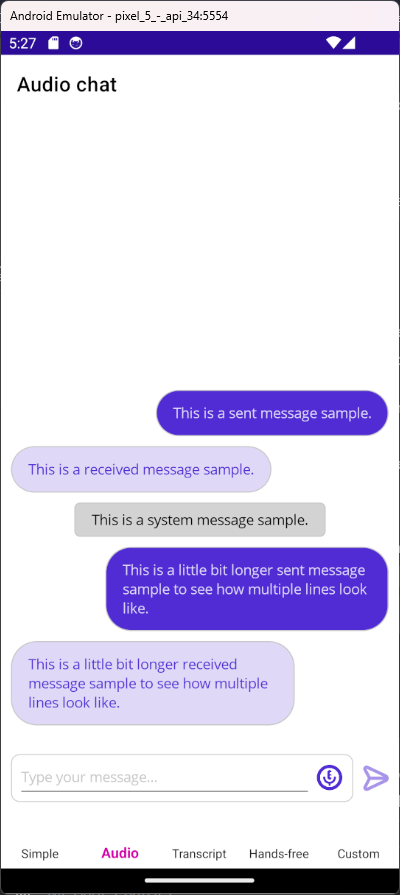
</a>
<a href="./assets/screenshots/audio_chat_03.png">
  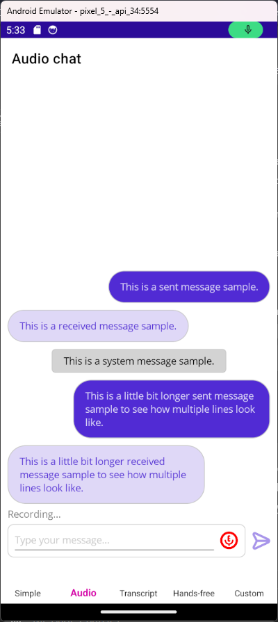
</a>
<a href="./assets/screenshots/audio_chat_04.png">
  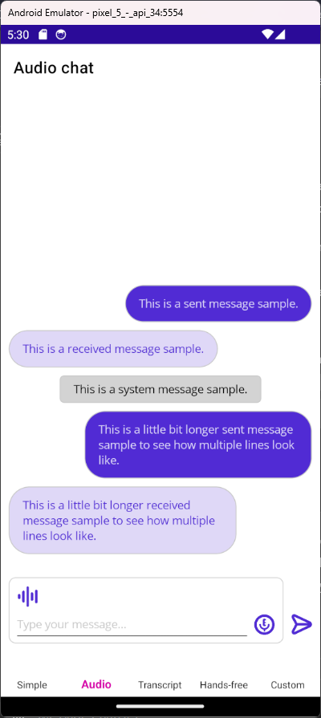
</a>
<a href="./assets/screenshots/audio_chat_05.png">
  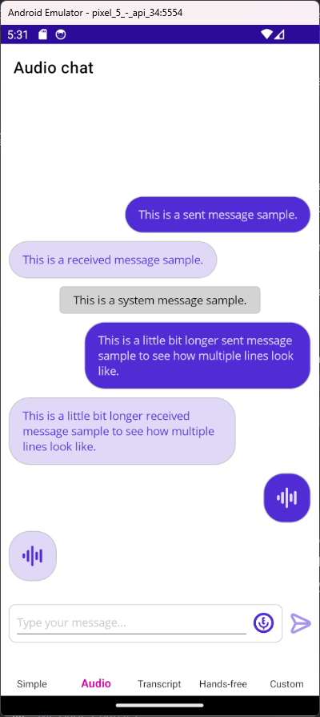
</a>

> [!WARNING]
> To use voice messaging setting relevant permissions to record audio is necessary.

`Chat` provides built-in functionality for voice messaging based on `Plugin.Maui.Audio`. Audio Recorder is equipped in silence detection, so recording should stop automatically when user stops speaking.

> [!WARNING]
> Silence detection is not yet available on iOS and MacOS.

In order to add voice messaging capability, just turn on Audio Recorder button visibility and add a property that will hold recorded audio content.

View:
```xaml
IsAudioRecorderVisible="True"
AudioContent="{Binding AudioContent}"
```

ViewModel:
```csharp
[ObservableProperty]
object? audioContent;
```

> [!NOTE]
> Audio recorder icon, color can be changed as shown in [Audio recorder button chapter](https://github.com/ArturWyszomirski/Plugin.Maui.Chat?tab=readme-ov-file#audio-recorder-button)

When recording is finished the Audio Player icon will pop up in the user message frame. Tap on it to listen to the recorder content.

> [!NOTE]
> Audio player icon, color can be changed as shown in [Audio player button chapter](https://github.com/ArturWyszomirski/Plugin.Maui.Chat?tab=readme-ov-file#audio-player-button)

Audio player will show up in every received and send message where `AudioContent` is not null.

> [!NOTE]
> Built-in features can also be changed to custom ones. In order to do that inject your own services instead of default ones as described in [Services chapter](https://github.com/ArturWyszomirski/Plugin.Maui.Chat?tab=readme-ov-file#services).

##### Speech-to-text

In order to turn on transcription set `IsSpeechToTextEnabled="True"`. Then, instead of generating `AudioContent`, the voice will be converted to text and added to `TextContent`.

> [!NOTE]
> This functionality utilize `CommunityToolkit`'s text-to-speech converter, but you're able to change this by injecting your own service. As always icon and its color can also be changed.

##### Text-to-speech

<a href="./assets/screenshots/trascription_chat_01.png">
  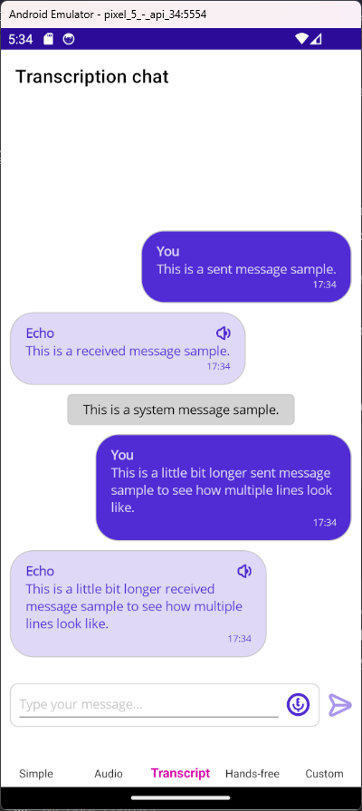
</a>
<a href="./assets/screenshots/trascription_chat_02.png">
  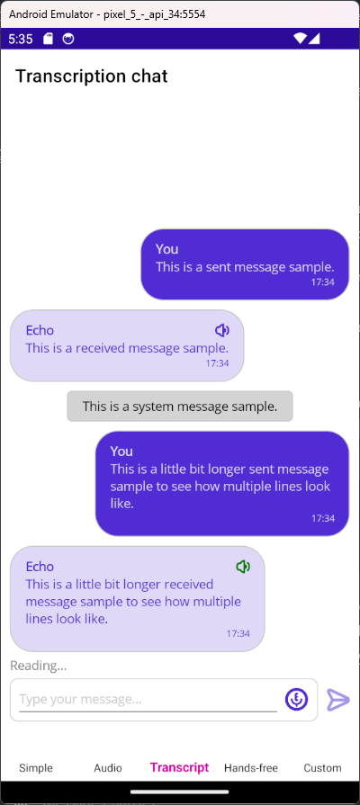
</a>

Setting `IsTextReaderVisible="True"` will result in showing up a text reader icon in every received message. 

> [!NOTE]
> This functionality utilize native text-to-speech converter, but you're able to change this by injecting your own service. As always icon and its color can also be changed.

##### Hands-free mode

<a href="./assets/screenshots/hands_free_chat_01.png">
  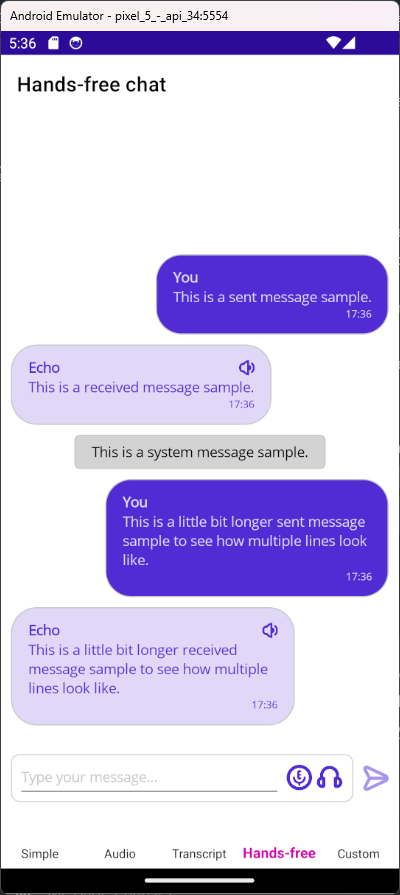
</a>
<a href="./assets/screenshots/hands_free_chat_02.png">
  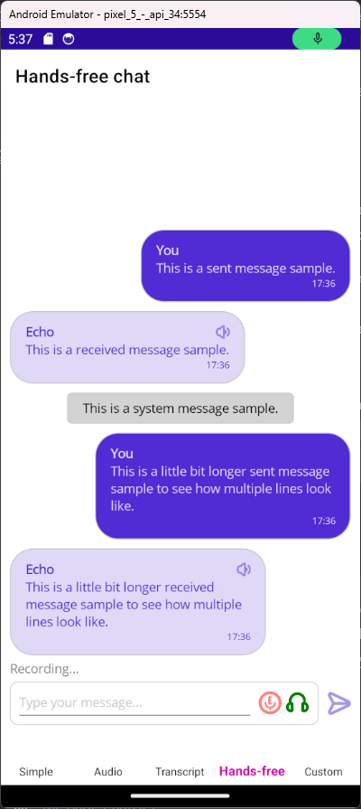
</a>

Hands-free mode is especially useful when using chat to communicate with bots. The idea is to loop those three steps:
- transcribe user's speech to text,
- send text, 
- read received answer.

The loop breaks when: user stops speaking and there is nothing to transcribe, speech-to-text was for some reason unsuccessful or user manually turns off hands-free mode.

This kind of functionality is strongly bound to send method and therefore it can't be delivered as a built-in feature. However to give en example how it could be implemented, there is a sample prepared. This sample uses Chat's `SpeechToTextService` and `TextToSpeechService` which are exposed in properties with the same names. Binding to those properties enables using native transcription and read methods.

### Customized usage

<a href="./assets/screenshots/customized_chat_01.png">
  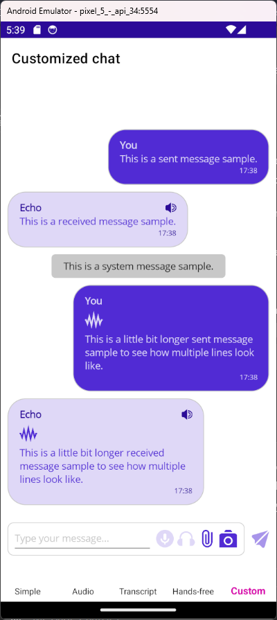
</a>

Many UI elements apperance can be easily changed as well as methods bound to commands in buttons. Below you will find code snippets for each section of `Chat` control and some descriptions.

#### Messages

##### Sent and received messages

The properties in both are analogous and related to colors of texts and background as well as visibility of message's author and timestamp fields.

```xaml
SentMessageBackgroundColor="{StaticResource Primary}"
IsSentMessageAuthorVisible="True"
SentMessageAuthorTextColor="{StaticResource Secondary}"
IsSentMessageTimestampVisible="True"
SentMessageTimestampTextColor="{StaticResource Secondary}"
SentMessageContentTextColor="{StaticResource Secondary}"
SentMessageAudioContentColor="{StaticResource Secondary}"

ReceivedMessageBackgroundColor="{StaticResource Secondary}"
IsReceivedMessageAuthorVisible="True"
ReceivedMessageAuthorTextColor="{StaticResource Tertiary}"
IsReceivedMessageTimestampVisible="True"
ReceivedMessageTimestampTextColor="{StaticResource Tertiary}"
ReceivedMessageContentTextColor="{StaticResource Primary}"
ReceivedMessageAudioContentColor="{StaticResource Primary}"
```

##### System message

You can set text and background color.

```xaml
SystemMessageBackgroundColor="{StaticResource Gray200}"
SystemMessageTextColor="{StaticResource Gray900}"
```

#### Status field

Status is a field just above the user entry. The purpose of this field is to inform user about some actions taking place, i.e. "Sandy is typing..."

```xaml
Status="{Binding Status}"
IsStatusVisible="{Binding IsStatusVisible}"
StatusTextColor="{StaticResource Gray500}"
```

`Status` is a string type. `IsStatusVisible` is a bool type. 

#### Message editor

To set up text editor colors set thoses properties.

```xaml
TextContentColor="{StaticResource Primary}"
MessageEntryBackgroundColor="{StaticResource Secondary}"
```

#### Buttons

All buttons expose properties that enable changing icons, colors, visibilty and commands.

##### Audio recorder button

By default audio recorder utilizes `Plugin.Maui.Audio` recoder using a silence detection which will automatically stop recording when user stop speaking. While recording the button will turn red.

```xaml
IsAudioRecorderVisible="True"
AudioRecorderIcon="{Static resources:Icons.Microphone}"
AudioRecorderColor="{StaticResource Primary}"
```

##### Audio player button

Whenever `AudioContent` in message is not null an audio player will pop up using `Plugin.Maui.Audio` to enable playing voice messages. While playing record the icon will turn green. 

> ![NOTE]
> AudioContent icon is by default not visible. Icon shows up when AudioContent is not null.

```xaml
AudioContentIcon="{Static resources:Icons.Waveform}"
AudioContentColor="{StaticResource Primary}"
```

##### Text reader button

By default text reader is not visible. To turn it on set `IsTextReaderVisible="True"`. While reading icon turns green.

```xaml
IsTextReaderVisible="True"
TextReaderColor="{StaticResource Tertiary}"
TextReaderIcon="{Static resources:Icons.Speaker}"
```

##### Hands-free mode button

By default hand-free mode is not visible and there is no method bound to its command. As this functionality is strictly bound to send method, you have to implement it by yourself. For more information, check out [Hands-free mode chapter](https://github.com/ArturWyszomirski/Plugin.Maui.Chat?tab=readme-ov-file#hands-free-mode)

```xaml
HandsFreeModeCommand="{Binding HandsFreeModeCommand}"
IsHandsFreeModeVisible="True"
HandsFreeModeIcon="{Static resources:Icons.Headphones}"
HandsFreeModeColor="{StaticResource Primary}"
```

##### Take photo button

```xaml
AddAttachmentCommand="{Binding AddAttachmentCommand}"
IsAddAttachmentVisible="True"
AddAttachmentIcon="{Static resources:Icons.PaperClip}"
AddAttachmentColor="{StaticResource Primary}"
```

##### Add attachment button

```xaml
TakePhotoCommand="{Binding TakePhotoCommand}"
IsTakePhotoVisible="True"
TakePhotoIcon="{Static resources:Icons.Camera}"
TakePhotoColor="{StaticResource Primary}"
```

##### Send message button

> [!NOTE]
> Send messagge button is disabled if message content is empty or chat is recording, transcribing or hands-free mode is on. This behavior can be overwritten by settind `IsSendMessageEnabled` property.

```xaml
SendMessageCommand="{Binding SendMessageCommand}"
IsSendMessageVisible="True"
SendMessageIcon="{Static resources:Icons.PaperPlane}"
SendMessageColor="{StaticResource Primary}"
```

### Services

Services used by `Chat` are exposed through relevant properties. This enables either to use default services or build and inject your own services.

> [!NOTE]
> See how to use default services in `HandsFreeViewModel` sample.

> [!NOTE]
> See how to use your own services in `CustomizedViewModel` sample.

#### `AudioService`: 

Implements `IAudioService`. Utilizes `Plugin.Maui.Audio`. Responsible for recording and playing audio.

##### Properties

`IsRecording` - shows whether audio is being currently recorded.

`SoundDetected` - set to true if there was a sound detected in latest recording in the latest recording (updated after recording is finished).

`IsPlaying` - shows whether audio is being currently played.

##### Methods

`Task<IAudioSource?> StartRecordingAsync(bool silenceDetection = true, double silenceTreshold = 2, TimeSpan silenceDuration = default)` - fired when audio recorder button is pressed, `IsRecording = false` and `IsSpeechToTextEnabled = false`.

`Task<IAudioSource?> StopRecordingAsync()` - fired when audio redorder button is pressed, `IsRecording = true` and `IsSpeechToTextEnabled = false`.

`Task StartPlayingAsync(IAudioSource? audioSource)` - fired when audio player button is pressed and `IsPlaying = false`.
    
`void StopPlaying()` - fired when audio player button is pressed and `IsPlaying = true`.

#### `SpeechToTextService`:

Implements `ISpeechToTextService`. Utilizes `CommunityToolkit`'s speech-to-text feature. Responsible for speech transcription.

##### Properties

`IsTranscribing` - shows whether speech is currently being transcribed.

##### Methods

`Task<string?> StartTranscriptionAsync()` - fired when audio recorder button is pressed, `IsTransribing = false`, and `IsSpeechToTextEnabled = true`.

`Task<string?> StopTranscriptionAsync()` - fired when audio recorder button is pressed, `IsTransribing = true`, and `IsSpeechToTextEnabled = true`.

#### `TextToSpeechService`:

Implements `ITextToSpeechService`. Utilizes MAUI's native text-to-speech feature. Responsible for reading text.

##### Properties

`IsReading` - shows whether text message is currently being read.

##### Methods

`Task StartReadingAsync(string? text)` - fired when text reader button is pressed, `IsReading = false`.

`void StopReading()` - fired when text reader button is pressed, `IsReading = true`.

## Credits

All icons comes from [flaticon.com](https://www.flaticon.com)'s UICONS series.

Icon was coloured using https://onlinepngtools.com/change